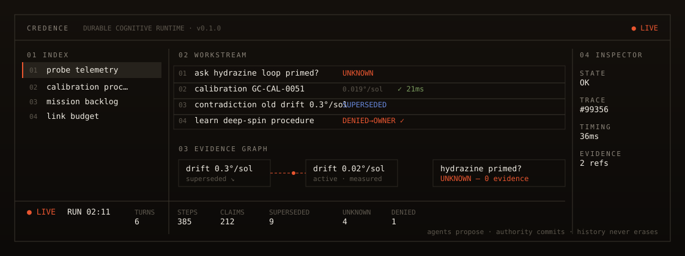
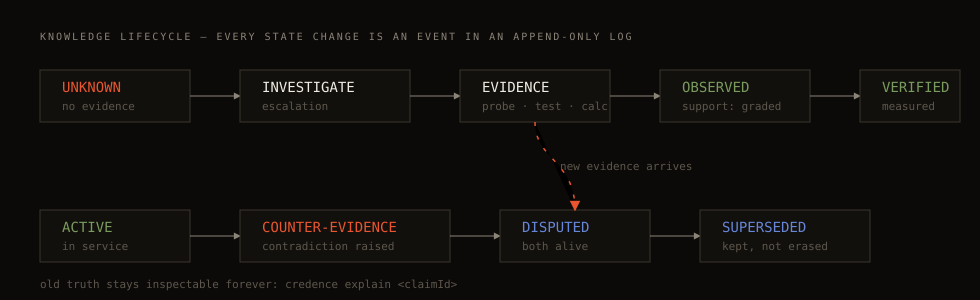
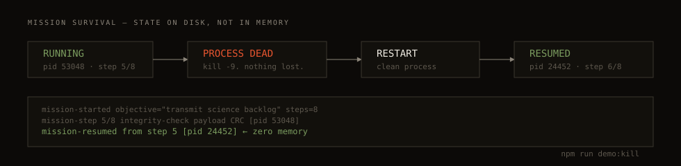
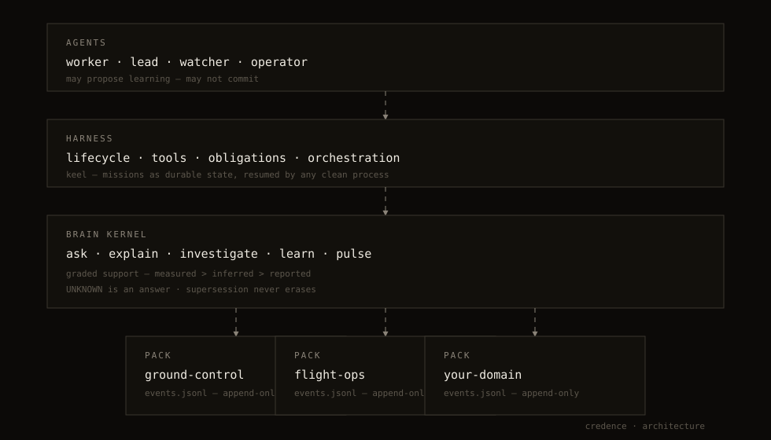

<p align="center"></p>

# credence

**MOST AGENTS REMEMBER TEXT. THIS ONE REMEMBERS EVIDENCE.**

[](https://github.com/MajidAsghariTabrizi/credence/actions/workflows/ci.yml)
[](LICENSE)
[](package.json)
[](package.json)

`credence` is an **evidence-first agent memory and durable mission runtime**. Not a vector store, not a RAG pipeline, not an orchestrator — the layer underneath all of them: an append-only knowledge ledger where every belief carries its evidence, every correction preserves its history, every learning passes an authority gate, and every mission survives its process.

- **You need it if** your agent runs for hours or days, and "remembering" currently means stuffing text into a context window.
- **It's different because** knowledge here has *epistemics*: graded support, evidence links, supersession chains, and an explicit UNKNOWN state. An agent powered by credence can answer *"I don't know — and here's the closest thing I do know, and why it doesn't qualify."*

## KILL THE AGENT. THE MISSION CONTINUES.

<p align="center"></p>

*(A timed replay of a real `npm run demo:kill` run — those are actual captured output lines and PIDs, not a mockup. Run it yourself below.)*

## Run it in 30 seconds

Requires Node ≥ 22.6. No install step, no API key, no model — the whole demo is deterministic and local.

```bash
git clone https://github.com/MajidAsghariTabrizi/credence
cd credence
npm run demo:kill
```

That kill-and-resume is one of four signature moments. Or run them one at a time:

| Moment | Command | What you see |
|---|---|---|
| **I DON'T KNOW** | `npm run demo:unknown` | A question with hearsay but no evidence → `UNKNOWN`, with the reason. No guessing. |
| **I CHANGED MY MIND** | `npm run demo:contradiction` | New calibration contradicts old belief → old claim superseded, **never erased**, full chain inspectable. |
| **I LEARNED — BUT NOT BY MYSELF** | `npm run demo:governed` | Worker agent proposes knowledge → `DENIED`. Owner commits. The worker then *reuses* what it was denied the right to teach itself. |

Or run everything: `npm run demo`.

Every headline claim in this README has a test, a command, or a fixture behind it — see [PROOF, NOT PROMISES](#proof-not-promises).

## The five ideas this repo owns

### 1. Memory with epistemics
A claim is not a string in a vector. It is a record:

```text
claim c_e21f0106
  text        "star tracker drifts 0.02°/sol after firmware 2.1 recalibration"
  support     measured            (measured > inferred > reported)
  basis       "post-firmware-2.1 calibration run GC-CAL-0051"
  evidence    e_cal0051 — 21-sol drift series, slope 0.019, r²=0.99
  state       active              (active | superseded | disputed)
  supersededBy []                 (grows — never rewrites)
```

### 2. UNKNOWN is a feature
`ask` returns `unknown` — with the reason and the nearest rejected candidate — whenever coverage is below threshold or evidence is absent. [Retrieval rule → `src/kernel/ask.ts`](src/kernel/ask.ts) · [Demo → `npm run demo:unknown`](demo/unknown.ts)

### 3. History is immutable
Corrections **supersede**. The old claim stays readable forever, linked to its replacement, with the contradiction event between them. [Fold → `src/kernel/store.ts`](src/kernel/store.ts) · [Demo → `npm run demo:contradiction`](demo/contradiction.ts)

### 4. Missions outlive processes
Mission state is an append-only log on disk (`keel`). Kill the process; a fresh one folds the log and continues. Mission state is *operational* state — it is never automatically trusted knowledge. [`src/kernel/keel.ts`](src/kernel/keel.ts) · [Demo → `npm run demo:kill`](demo/kill.ts)

### 5. Learning has authority
Agents may discover and propose. Only `owner`/`lead` commit durable knowledge. A denied commit is logged, not lost — the proposal waits for review. [`src/kernel/learn.ts`](src/kernel/learn.ts) · [Demo → `npm run demo:governed`](demo/governed.ts)



## PROOF, NOT PROMISES

| Claim | Run this | Read this |
|---|---|---|
| "It says I DON'T KNOW" | `npm run demo:unknown` | [`test/kernel.test.ts` · unknown](test/kernel.test.ts) |
| "It changes its mind without deleting its past" | `npm run demo:contradiction` | [`store.ts` · supersession fold](src/kernel/store.ts) |
| "Workers cannot commit" | `npm run demo:governed` | [`learn.ts` · authority gate](src/kernel/learn.ts) |
| "Missions survive process death" | `npm run demo:kill` | [`keel.ts` · durable resume](src/kernel/keel.ts) |
| "Retrieval quality is measured" | `npm run bench` | [`bench/` · fixtures + runner](bench/run.ts) |
| "Zero dependencies" | `cat package.json` | — |

Benchmarks are synthetic, seeded (deterministic), and honest — [latest results](bench/results.json) on this exact kernel: unknown-detection **1.00**, hallucination-on-unanswerable **0**, paraphrase recall **0.65** (token-coverage retrieval, no embeddings), ask latency p95 **~1.3 ms** at 200 claims. Weak numbers stay published.



## Architecture



```text
Agents      worker · lead · watcher · operator      (propose, never commit)
Harness     lifecycle · tools · keel missions       (durable operational state)
Brain       ask · explain · investigate · learn · pulse
Packs       ground-control/ … each an events.jsonl  (append-only, one fold away)
```

One process, one directory, zero dependencies. The event log *is* the database — no migrations, no server. [Deep dive → `docs/ARCHITECTURE.md`](docs/ARCHITECTURE.md).

### Deep rabbit holes

<details><summary><b>What happens when the Brain doesn't know?</b></summary>

`ask` scores every active claim by *query coverage* (fraction of your question's content tokens present in the claim) weighted by support grade. Below 0.45 — or any best match with zero evidence — you get `state: unknown` with `why` and the `nearest` rejected candidate. You can then `investigate`: collectors gather findings, split into **durable candidates** (commit via `learn`) and **ephemeral observations** (never commit — a measured value is wrong tomorrow).

</details>

<details><summary><b>What happens when new evidence contradicts old evidence?</b></summary>

A `supersede` delta writes two events: `contradiction-raised` (both ids + the note) and `claim-superseded` (old → new). The fold marks the old claim `superseded` and appends the successor id. `explain <claimId>` walks the whole chain. Nothing is deleted; the log only grows.

</details>

<details><summary><b>What exactly is allowed to learn?</b></summary>

Caller identity is a role: `owner`, `lead:*`, `agent:*`, `watcher`. `propose()` records the delta as a pending proposal; `agent`/`watcher` commits are refused with a `learning-denied` event — the denial itself is part of history. `owner`/`lead` approve with `commitProposal`. Private claims (`sensitivity: private`) are filtered out of agent reads at the store layer.

</details>

<details><summary><b>What survives a dead process?</b></summary>

Everything that was appended before the kill: claims, evidence, proposals, mission steps. The keel writes each step *after* it completes, so a kill mid-step replays that step — never skips, never duplicates. `mission-resumed` events count interruptions.

</details>

## Honest status

| Capability | Status |
|---|---|
| Append-only claim ledger, supersession, provenance | **WORKING + TESTED** |
| UNKNOWN detection (coverage + evidence gates) | **WORKING + MEASURED** |
| Authority model (propose/deny/commit) | **WORKING + TESTED** |
| Durable missions, kill-and-resume | **WORKING + TESTED** (single-process CLI scale) |
| Packs (domain stores) | **WORKING** (registry is minimal) |
| Token-coverage retrieval | **WORKING + MEASURED** — deliberately simple; no embeddings yet |
| Reflex / system-1 layer | **NOT IMPLEMENTED** |
| LLM-backed collectors | **NOT IMPLEMENTED** (collectors are deterministic functions — bring your own model) |
| DeepSeek Harness integration | **EXPERIMENTAL** — [`integrations/deepseek-harness/`](integrations/deepseek-harness/README.md) |

This is v0.1.0: a small, complete, honest kernel — not a platform. The gaps above are the roadmap.

## DeepSeek Harness integration

Credence is an integration target, not a dependency. The [adapter](integrations/deepseek-harness/README.md) exposes `ask` / `learn` / `pulse` to a DeepSeek Harness agent session via the kernel's programmatic API — an agent can consult the ledger and propose learnings (it will be correctly DENIED if it tries to self-commit). Unaffiliated with DeepSeek; the harness is just a good host.

## Contributing

Issues and PRs welcome — [good first issues](https://github.com/MajidAsghariTabrizi/credence/labels/good%20first%20issue) are marked. Read [CONTRIBUTING.md](CONTRIBUTING.md). The kernel is ~700 lines of dependency-free TypeScript on purpose: read it in one sitting before extending it.

## License

[MIT](LICENSE) · © 2026 Majid Asghari Tabrizi. The synthetic demo domain (probe *MNEMOSYNE-7*) is fiction; any resemblance to real spacecraft telemetry is a calibration error.
